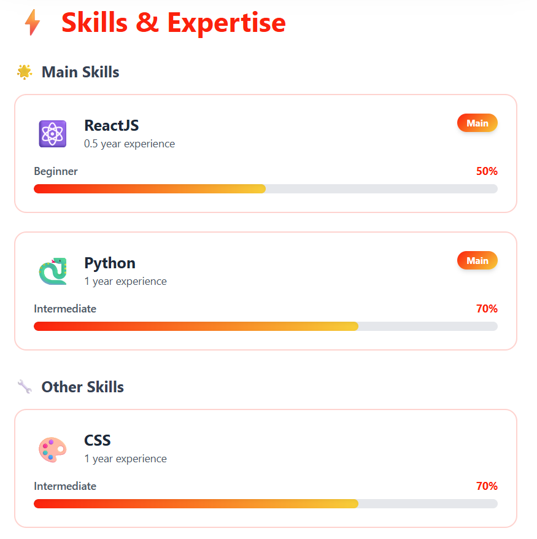
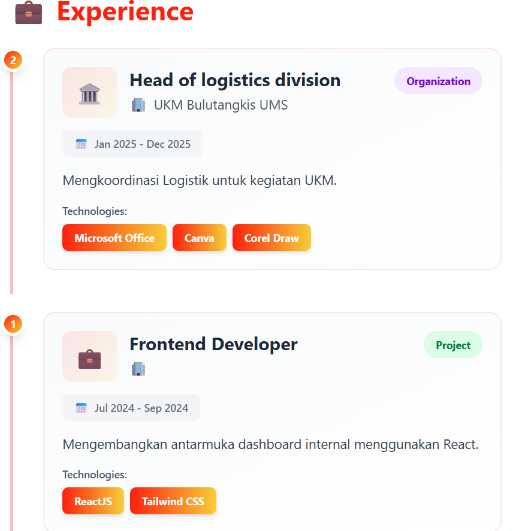

# 📝 CV Mahasiswa - Single Page Application

## 📋 Deskripsi Aplikasi

Aplikasi Single Page Application (SPA) untuk menampilkan CV/Portfolio mahasiswa yang dibangun menggunakan ReactJS dan Tailwind CSS. Aplikasi ini menampilkan informasi profil, skills, dan pengalaman mahasiswa dengan desain modern dan interaktif.

### 🎯 Fitur Utama

- **Profile Section**: Menampilkan informasi pribadi, foto profil, NIM, prodi, angkatan, lokasi, dan statistik profile completion
- **Skills Section**: Menampilkan skills dengan kategori (Main Skills & Other Skills), level kemampuan, progress bar, dan tahun pengalaman
- **Experience Section**: Menampilkan pengalaman kerja/organisasi/project dengan timeline, badge type, dan technologies yang digunakan
- **Responsive Design**: Tampilan optimal di berbagai ukuran layar (mobile & desktop)
- **Interactive UI**: Hover effects, animations, dan smooth transitions
- **Data-driven**: Data dibaca otomatis dari file JSON terpisah

## 🚀 Cara Menjalankan Project

### Prerequisites

Pastikan sudah terinstall:

- **Node.js**
- **npm**

### Langkah Instalasi

1. **Clone repository**

   ```bash
   git clone <URL-REPOSITORY  >
   ```

2. **Install dependencies**

   ```bash
   npm install
   ```

3. **Jalankan development server**

   ```bash
   npm run dev
   ```

4. **Buka browser**

   Aplikasi akan berjalan di: `http://localhost:517`

## 🌐 Deployment Link

**Live Demo**: (https://vercel.com/kurakuramesirs-projects/cv-teduh-l200240223)

## 📸 Screenshots

### 1. Profile Section


> Menampilkan informasi lengkap profil mahasiswa dengan foto, headline, dan badge informasi

### 2. Skills Section



> Menampilkan Main Skills dan Other Skills dengan progress bar dan level kemampuan

### 3. Experience Section



> Menampilkan timeline pengalaman dengan badge type dan technologies

## 🛠️ Teknologi yang Digunakan

### Frontend

- **ReactJS** v18.x - JavaScript library untuk membangun UI
- **Tailwind CSS** v3.x - Utility-first CSS framework
- **JavaScript ES6+** - Modern JavaScript

### Development Tools

- **Create React App** - React toolchain
- **npm** - Package manager
- **Git** - Version control

### Deployment

- **Vercel** / **Netlify** - Static site hosting

---

## 👨‍💻 Dibuat oleh

**Nama**: Teduh Dewantara  
**NIM**: L200240223  
**Prodi**: Teknik Informatika  
**Angkatan**: 2024  
**Universitas**: Universitas Muhammadiyah Surakarta

---
